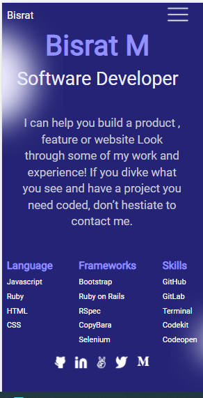

# Microverse Portfolio

> This project is to show up my previous work port and practice figma, html, css(Flexbox), and Github workflow.

Additional description about the project and its features.

## Built With

- HTML, CSS and MD
- Linter

## Live Demo

[Live Demo Link](https://bushmusi.github.io/Microverse-Portfolio/)

## Getting Started

To get a local copy up and running follow these simple example steps.

### Prerequisites 

- Lighthouse installed

### Setup
- Install node.js

### Install
- Open index.html file in your prefarable browser

## Authors

👤 **Bushra M**

- GitHub: [@githubhandle](https://github.com/bushmusi)
- Twitter: [@twitterhandle](https://twitter.com/bushera_mestofa)
- LinkedIn: [LinkedIn](https://linkedin.com/in/bushra-mustofa-2620671b7/)

## 🤝 Contributing

Contributions, issues, and feature requests are welcome!

Feel free to check the [issues page](https://github.com/bushmusi/Microverse-Portfolio/issues).

## Show your support

Give a ⭐️ if you like this project!

## Acknowledgments

- Microverse